# Taiwan Fin Hub

自架個人理財整合工具，將銀行、投資、信用卡、電子發票集中在同一個介面查看。

> 本專案由 [kevchentw/taiwan-fin-hub](https://github.com/kevchentw/taiwan-fin-hub) 分支而來，並在原專案基礎上持續擴充資料來源、同步流程與 UI/UX。感謝原作者與貢獻者奠定專案基礎。

## 支援資料來源

| 資料來源     | 銀行帳戶與交易                                                                 | 信用卡帳務                       | 投資                          | 發票               | 驗證與登入                                              |
| ------------ | ------------------------------------------------------------------------------ | -------------------------------- | ----------------------------- | ------------------ | ------------------------------------------------------- |
| 電子發票載具 | —                                                                              | —                                | —                             | 載具發票與品項明細 | 使用電子發票 App 帳號與密碼；登入狀態失效時會重新登入   |
| 集保 e 存摺  | 交割帳戶餘額與明細（[支援銀行列表](https://epassbook.tdcc.com.tw/zh/g1.aspx)） | —                                | 股票、ETF、基金持倉與投資交易 | —                  | 首次或新裝置登入可能需要 Email／簡訊 OTP                |
| 玉山銀行     | 存款帳戶、餘額與交易                                                           | 信用卡帳單與刷卡交易             | —                             | —                  | 透過 Browser Rendering 登入；session 失效時需要重新登入 |
| 國泰世華銀行 | 存款帳戶、餘額與交易                                                           | 信用卡帳單與刷卡交易             | —                             | —                  | 每次同步透過 Browser Rendering 登入；額外驗證需人工處理 |
| 永豐行動銀行 | —                                                                              | 信用卡總覽、近期帳單與未出帳消費 | —                             | —                  | Gemma 4 自動辨識圖形驗證碼；連續三次失敗才需人工輸入    |

## 已知限制

- 本專案並非銀行或政府機關提供的官方服務。連接器依賴各資料來源的網頁、App API 或回應格式；對方改版後可能需要更新連接器才能恢復同步。
- 銀行可能臨時要求圖形驗證碼、OTP、裝置驗證或處理重複登入，也可能主動讓既有 session 失效。永豐會先以 Gemma 4 自動辨識，連續三次失敗後仍需回到設定頁人工輸入；其他銀行遇到互動式驗證時也需人工處理。
- 集保 e 存摺在首次登入、新裝置或信任狀態失效時，可能要求 Email 與簡訊 OTP；系統不會繞過任何互動式安全驗證。
- 排程同步會優先沿用仍有效的登入狀態；永豐 session 失效時會自動重新登入。需要人工驗證時，該次同步會停止並標示為「需要處理」，完成驗證後才能繼續。
- 資料更新時間與完整性取決於外部服務，畫面內容不應視為銀行、券商或財政部的即時正式對帳資料。

## 目前介面

以下畫面取自本分支目前版本，內容使用匿名 Demo 資料。

### 桌面／手機對照

| 桌面版總覽                                                                                                                         | 手機版總覽                                                                                                                                     |
| ---------------------------------------------------------------------------------------------------------------------------------- | ---------------------------------------------------------------------------------------------------------------------------------------------- |
| <a href="images/screenshots/01-dashboard.png">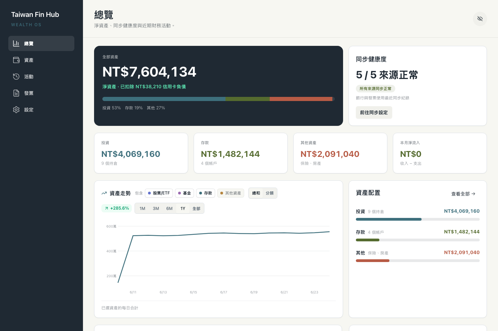</a> | <a href="images/screenshots/08-overview-mobile.png">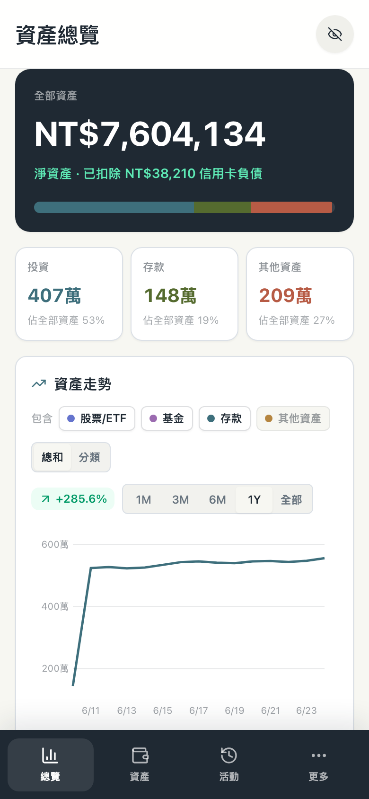</a> |

### 更多畫面

| 資產                                                                                                       | 活動                                                                                                           | 發票                                                                                                           |
| ---------------------------------------------------------------------------------------------------------- | -------------------------------------------------------------------------------------------------------------- | -------------------------------------------------------------------------------------------------------------- |
| <a href="images/screenshots/05-assets.png">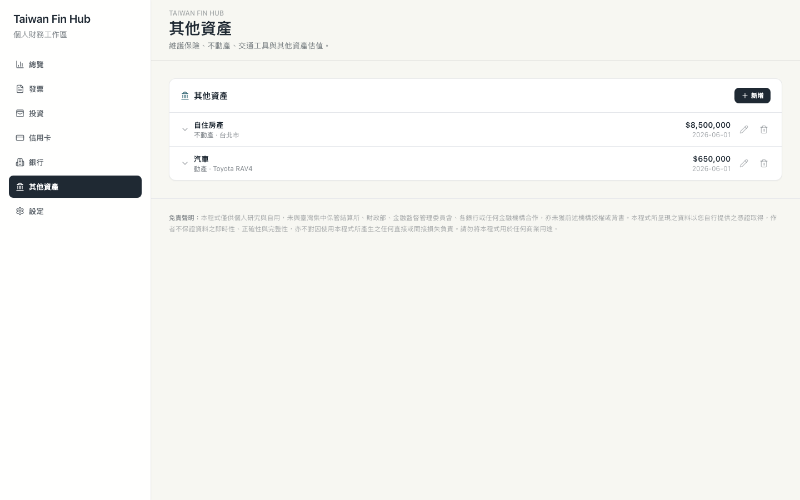</a> | <a href="images/screenshots/07-activity.png">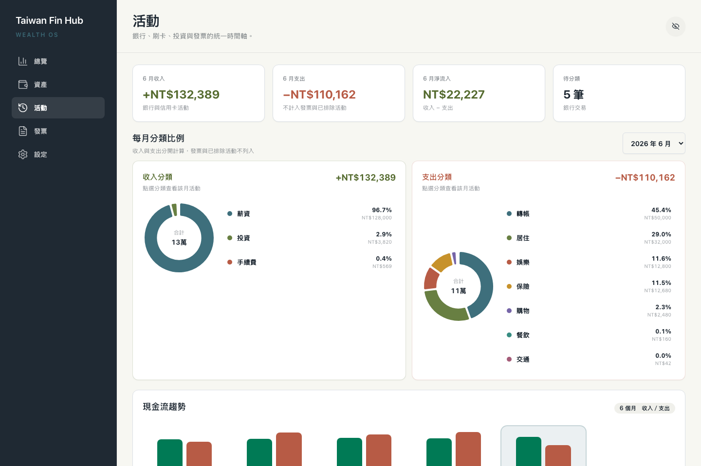</a> | <a href="images/screenshots/02-invoices.png">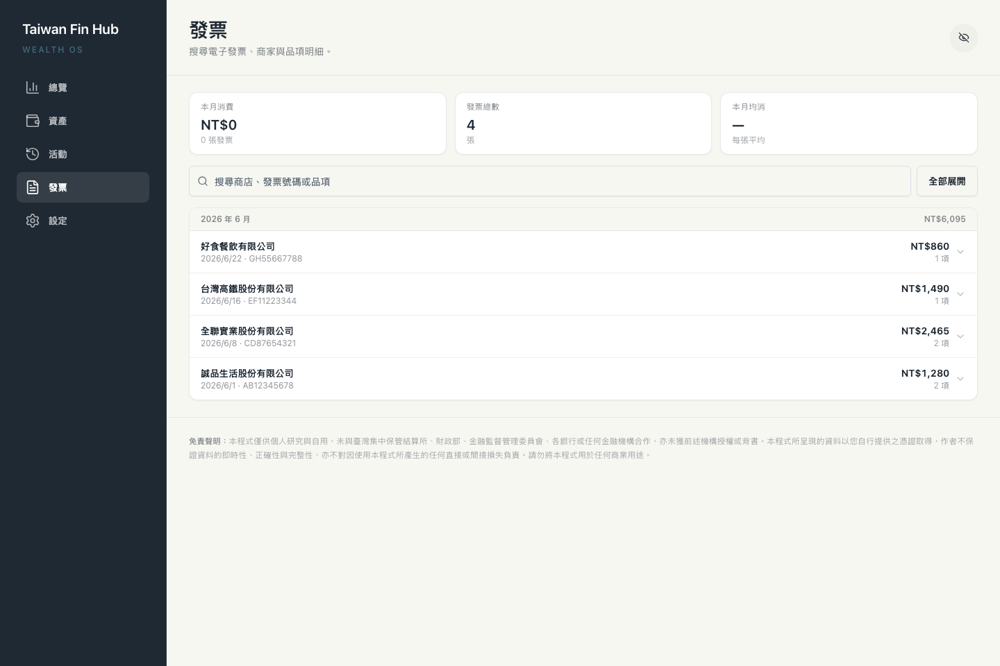</a> |

| 投資                                                                                                                 | 銀行                                                                                                   | 設定與資料來源                                                                                                           |
| -------------------------------------------------------------------------------------------------------------------- | ------------------------------------------------------------------------------------------------------ | ------------------------------------------------------------------------------------------------------------------------ |
| <a href="images/screenshots/03-investments.png">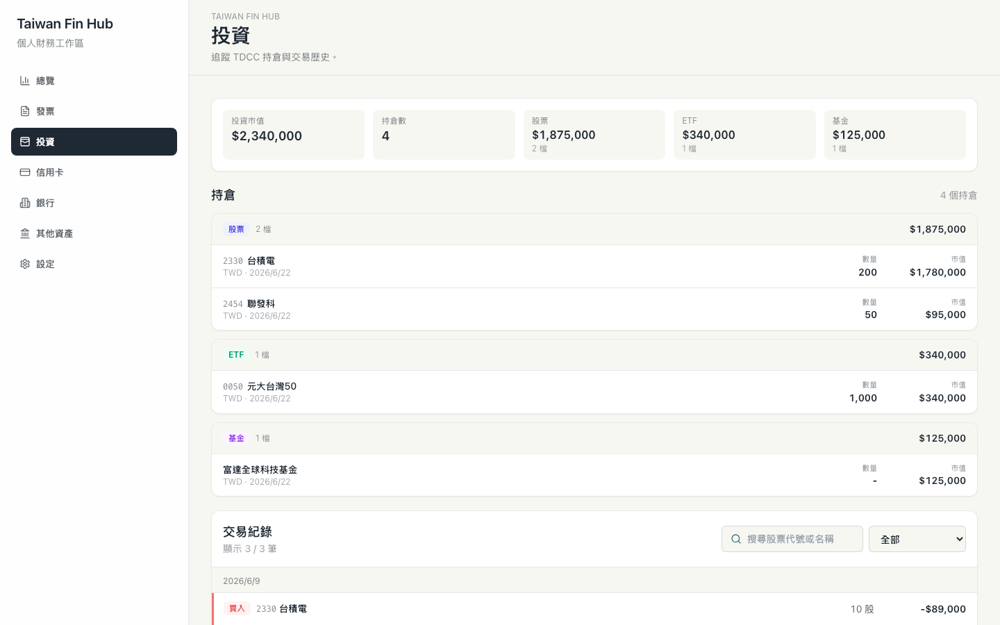</a> | <a href="images/screenshots/04-bank.png">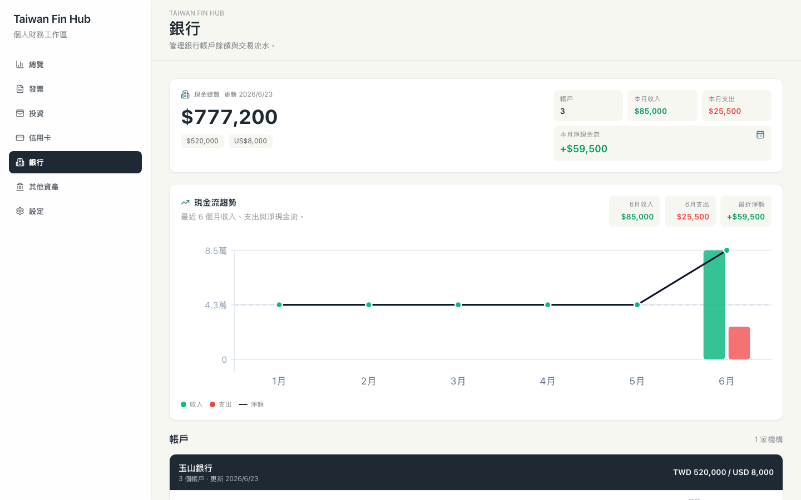</a> | <a href="images/screenshots/06-settings.png">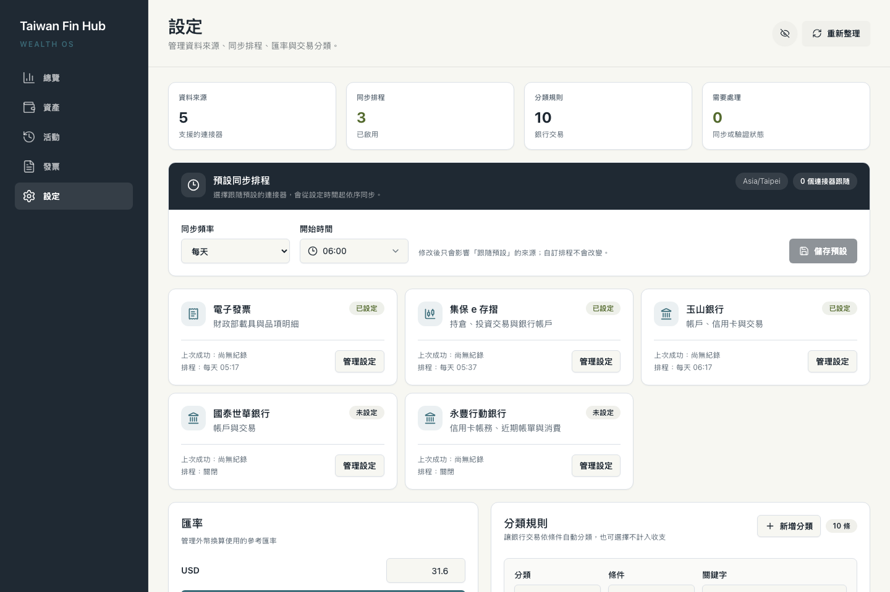</a> |

## 技術架構

| 層級       | 技術                                    | 用途                                                 |
| ---------- | --------------------------------------- | ---------------------------------------------------- |
| Web        | Svelte 5、TypeScript、Tailwind CSS 4    | 響應式介面、資料查詢與視覺化                         |
| API        | Cloudflare Workers、Hono                | 提供 API、執行同步流程與靜態網站                     |
| 資料庫     | Cloudflare D1                           | 儲存加密後的連接器設定、金融資料、分類規則與同步狀態 |
| 登入保護   | Cloudflare Access                       | 驗證使用者身分，Worker 端驗證 Access JWT             |
| 銀行連接器 | Cloudflare Browser Run、Puppeteer       | 處理需要瀏覽器的銀行登入與資料擷取                   |
| 驗證碼辨識 | Cloudflare Workers AI                   | 辨識銀行登入流程中的驗證碼（CAPTCHA）                |
| 排程同步   | Workers Cron Triggers、D1 sync jobs     | 執行週期同步、鎖定同步工作並記錄需要人工處理的狀態   |
| 專案結構   | npm workspaces                          | 管理 Web、Worker、共用型別、資料庫與連接器套件       |

---

## 部署

**需要：** [Cloudflare 帳號](https://dash.cloudflare.com/signup)、[GitHub 帳號](https://github.com/signup)

> 玉山與國泰連接器會使用 [Cloudflare Browser Run](https://developers.cloudflare.com/browser-run/)。Workers Free Plan 每日包含 10 分鐘瀏覽器使用量；大量或頻繁同步可能超過免費額度。

### 步驟一：一鍵部署

點擊下方按鈕。Cloudflare 會在你的 GitHub 帳號建立一份新的 repository、自動建立 D1 Database，並部署至 Cloudflare Workers：

[](https://deploy.workers.cloudflare.com/?url=https://github.com/TedLin1993/taiwan-fin-hub)

首次使用需透過 **Git account → New Github Connection** 授權 Cloudflare 存取 GitHub：

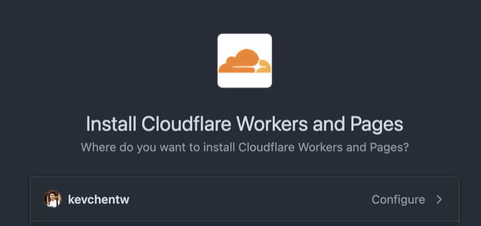

選擇帳號後點 **Install & Authorize**：

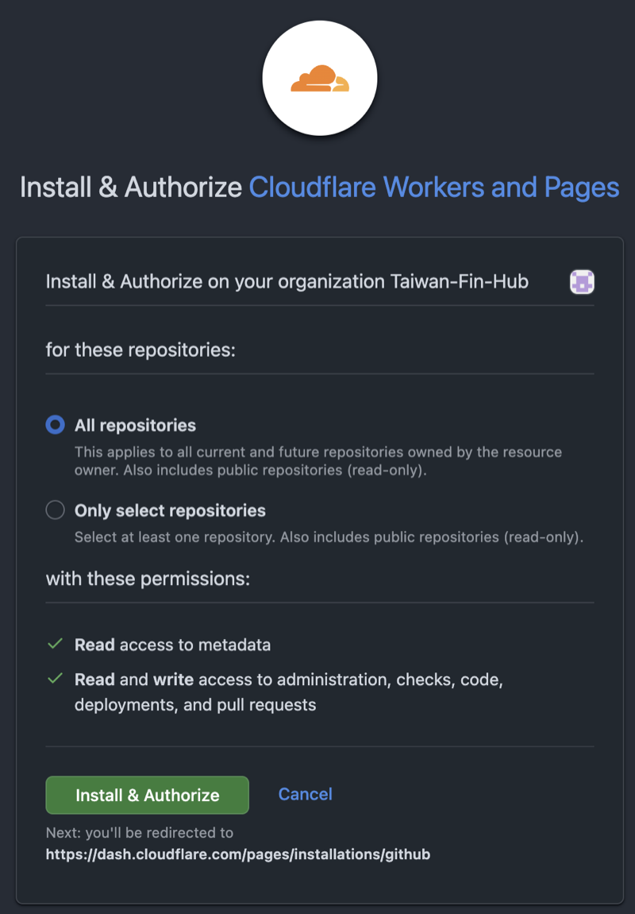

接著填寫部署設定。此時只需要設定 `CONFIG_ENCRYPTION_KEY`，`TEAM_DOMAIN` 與 `POLICY_AUD` 留待步驟二設定：

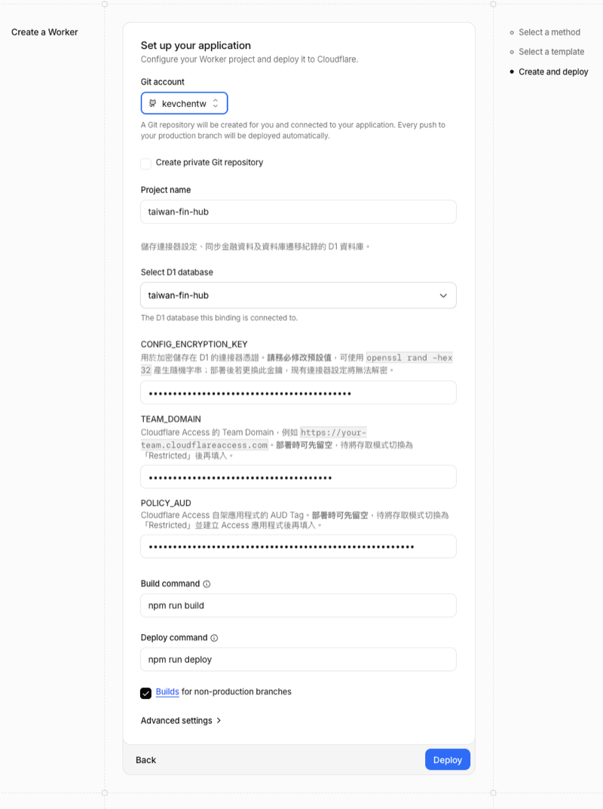

| Secret                  | 說明                                                                                                       |
| ----------------------- | ---------------------------------------------------------------------------------------------------------- |
| `CONFIG_ENCRYPTION_KEY` | 加密連接器帳密的金鑰。可使用 `openssl rand -hex 32` 產生；請妥善保存，遺失或更換後需重新設定所有連接器。 |

點擊 **Deploy**，看到綠色勾勾即表示部署成功：

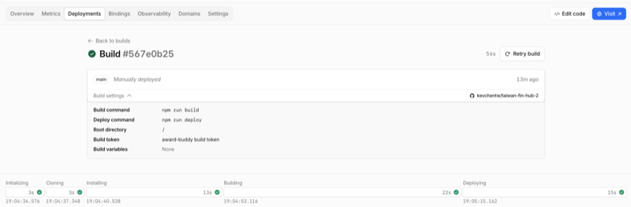

### 步驟二：啟用登入保護

1. 前往 [Cloudflare Dashboard](https://dash.cloudflare.com/) → **Workers & Pages**，選擇剛建立的 `taiwan-fin-hub`
2. 開啟 **Domains** 頁籤，將 Worker URL 旁的存取模式從 **Public** 改為 **Restricted**
3. 若介面沒有 **Domains** 頁籤，請改至 **Settings → Domains & Routes**，在 `workers.dev` 網址旁啟用 Cloudflare Access

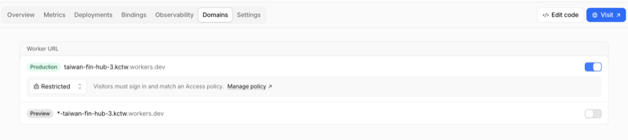

切換成 **Restricted** 後，Cloudflare 會顯示以下兩個值：

- **Audience (aud)**：一串 hex 字串，對應 `POLICY_AUD`
- **JWKs URL**：格式為 `https://xxxxxxxx.cloudflareaccess.com/cdn-cgi/access/certs`，其中前面的網域即為 `TEAM_DOMAIN`

接著前往 **Settings → Variables and secrets**，設定以下 Secret：

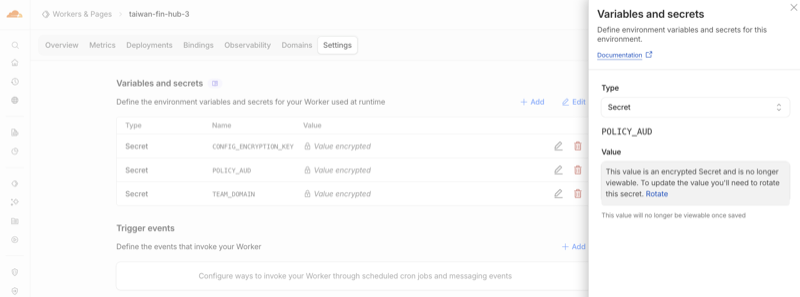

| Secret        | 值                                                            |
| ------------- | ------------------------------------------------------------- |
| `TEAM_DOMAIN` | JWKs URL 的網域，例如 `https://yourteam.cloudflareaccess.com` |
| `POLICY_AUD`  | Audience (aud) 的 hex 值                                      |

> 完成此步驟後即可開始使用系統。

> 進階用法：若同一個 Worker 需要接受多個 Access Application，可另外設定 `POLICY_AUDS`，以逗號或空白分隔多個 Audience。

若要啟用同步完成推播，請另外產生一組固定的 VAPID 金鑰，並在同一個 Worker 的 **Variables and secrets** 設定：

```bash
npx web-push generate-vapid-keys
wrangler secret put VAPID_PUBLIC_KEY
wrangler secret put VAPID_PRIVATE_KEY
```

`VAPID_SUBJECT` 可省略，程式會使用內建的 `mailto:admin@example.com` 預設值；若要提供實際聯絡方式，可自行設定為 `mailto:` 或 `https:` URI。VAPID public/private key 必須在同一個部署中保持不變；若更換金鑰，既有瀏覽器訂閱需要重新開啟推播。

### 步驟三：確認部署

1. 開啟 Worker 的 `workers.dev` 網址，確認會先要求 Cloudflare Access 登入
2. 登入後前往「連接器」頁面設定資料來源
3. 點擊同步以取得最新資料

### 步驟四（進階）：調整登入方式與有效期限

Cloudflare Access 可能使用 Email OTP，登入狀態預設會在 24 小時後過期。以下為進階設定，非必要。

#### 使用 Cloudflare 帳號登入

1. 前往 **Zero Trust → Integrations → Identity providers**
2. 確認列表中是否已有 **Cloudflare**
3. 若沒有，點選 **Add new identity provider → Cloudflare**
4. 啟用 **Restrict to account members**，避免非此 Cloudflare 帳號成員登入
5. 儲存設定

新建立的 Zero Trust organization 通常已預設啟用 Cloudflare identity provider，不需要另外新增。

接著前往 **Zero Trust → Access controls → Applications**，選擇 `taiwan-fin-hub`：

1. 進入 **Authentication**
2. 將登入方式設為 **Cloudflare**
3. 若只使用此登入方式，可啟用 **Apply instant authentication**，直接進入 Cloudflare 登入流程，不再顯示登入方式選擇頁

#### 將登入期限延長至一個月

1. 在 `taiwan-fin-hub` Access Application 的設定中，將 **Session Duration** 設為 **1 month**
2. 前往 **Zero Trust → Access controls → Access settings**
3. 將 **Global session duration** 也設為 **1 month**

若 Access Policy 另外設定了 Session Duration，也請將該 Policy 的期限調整為一個月，否則會以較短的 Policy 設定為準。

---

## 本機開發

本機 Wrangler 設定不納入版本控制。第一次啟動前請建立私人設定檔，並填入自己的 D1 Database ID：

```bash
cp apps/worker/wrangler.local.toml.example apps/worker/wrangler.local.toml
npm install
npm run dev
```

本機永豐自動驗證會透過 `AI` remote binding 呼叫 Workers AI，需先完成 Wrangler 登入，並會計入 Cloudflare Workers AI 用量。

若需從本機部署至既有的 D1，請複製 `wrangler.toml` 為被忽略的 `wrangler.private.toml`、加入 `database_id`，並以 `wrangler --config wrangler.private.toml` 執行遠端遷移或部署。

後端目錄責任、API 約定與驗證指令請參考 [`docs/002-backend-architecture.md`](docs/002-backend-architecture.md)。

---

## 更新

Deploy to Cloudflare 會將本專案複製成你 GitHub 帳號下的新 repository，而不是建立 Fork。部署後的 repository 會透過 GitHub Actions 每天同步一次本專案 `main` branch 的最新版本。

### 自動更新（推薦）

`Sync Latest Version` workflow 會在每天台灣時間 **04:15** 執行：

1. 取得 `TedLin1993/taiwan-fin-hub` 的最新 `main`
2. 以一般 Git merge 合併至部署 repository 的 `main`
3. 將更新推送至部署 repository
4. 由 Cloudflare Workers Builds 自動重新部署

若需要立即更新，可前往部署 repository 的 **Actions → Sync Latest Version → Run workflow** 手動執行。

若 workflow 因權限不足而無法 push，請前往 **Settings → Actions → General → Workflow permissions**，確認允許 GitHub Actions 讀寫 repository 內容。

自動更新不會使用 force push。若你曾自行修改程式碼，且與上游更新發生 merge conflict，workflow 會停止並保留目前可用版本；請在 GitHub Actions 執行紀錄中查看錯誤並手動解決衝突。

### 手動透過 Git 更新

也可以在本機操作部署後的 repository。第一次更新前先加入 upstream：

```bash
git remote add upstream https://github.com/TedLin1993/taiwan-fin-hub.git
```

之後執行：

```bash
git switch main
git pull upstream main
git push origin main
```

推送至 `main` 後，Cloudflare Workers Builds 會自動部署新版本。

### 重新部署

若自動或手動更新無法使用，也可以點擊下方按鈕重新走一次部署流程：

[](https://deploy.workers.cloudflare.com/?url=https://github.com/TedLin1993/taiwan-fin-hub)

1. **Project Name** 填新名稱，例如 `taiwan-fin-hub-v2`
2. **Select D1 Database** 選擇原有資料庫（`taiwan-fin-hub` 或你自訂的名稱）
3. **CONFIG_ENCRYPTION_KEY** 若有保留原本的值請填入相同值；填新值則需重新設定所有連接器
4. 其餘步驟同首次部署。新版本會有新的 Worker URL，但資料庫沿用原有的，資料不會遺失

---

## 安全機制

### 登入保護

本應用以 [Cloudflare Access](https://www.cloudflare.com/zero-trust/products/access/) 作為唯一登入閘道，不自行管理帳號密碼或 session。每個請求都必須附帶 Cloudflare 簽發的 JWT，Worker 端會：

1. 從 Cloudflare Access JWKS 端點取得公鑰（`/cdn-cgi/access/certs`）
2. 以 **RS256（RSA + SHA-256）** 驗證 JWT 簽章
3. 確認 issuer、audience 正確且 JWT 未過期

若同一個 Worker 需要接受多個 Cloudflare Access Application 的 JWT，可設定 `POLICY_AUDS`，例如：

```env
POLICY_AUDS=production-aud-hex,private-aud-hex
```

`POLICY_AUD` 仍可保留作為單一 audience 設定；兩者同時存在時，任一 audience 符合即通過驗證。

驗證失敗一律回傳 `401`。

### 連接器帳密保護

銀行帳號、密碼等敏感資料在寫入資料庫前一律加密：

1. 以 `CONFIG_ENCRYPTION_KEY` 透過 **SHA-256** 衍生 256-bit 金鑰
2. 使用 **AES-GCM** 加密，每次產生隨機 96-bit IV
3. 資料庫只儲存密文（版本號、演算法、IV、ciphertext 均 Base64 編碼），明文從不落地

> **注意**：目前未提供金鑰輪替機制。更換 `CONFIG_ENCRYPTION_KEY` 後，既有的加密資料將無法解密，需要重新設定所有連接器。

---

## 免責聲明

本程式僅供個人研究與自用，未與臺灣集中保管結算所、財政部、金融監督管理委員會、各銀行或任何金融機構合作，亦未獲前述機構授權或背書。本程式所呈現之資料以您自行提供之憑證取得，作者不保證資料之即時性、正確性與完整性，亦不對因使用本程式所產生之任何直接或間接損失負責。請勿將本程式用於任何商業用途。

---

## License

本專案採用 [MIT License](LICENSE)，並保留原專案的著作權與授權聲明。
