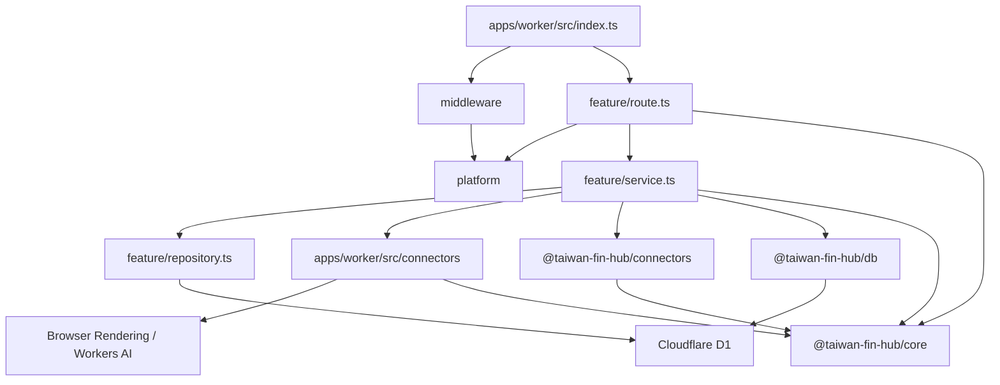
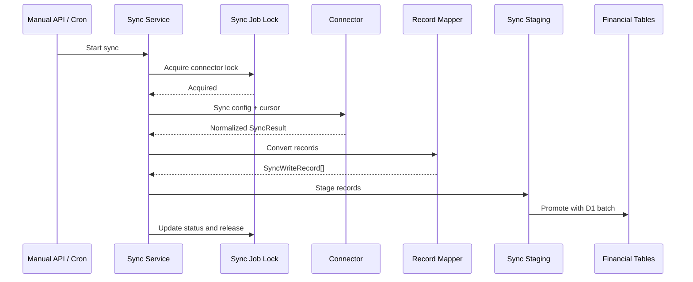

# 後端架構與維護約定

後端執行於 Cloudflare Workers，使用 Hono 提供 API，並透過 Cloudflare D1、Browser Rendering、Workers AI 與 Cron Triggers 完成資料儲存、銀行登入、驗證碼辨識及排程同步。

目前後端採用 **feature-oriented Vertical Slice Architecture**。程式依業務功能分組，而不是將所有 Controller、Service、Repository 分別集中在全域目錄。

`apps/worker/src/index.ts` 是 Composition Root，只負責：

- 建立 Hono application。
- 註冊全域 middleware。
- 組裝各 feature routes。
- 設定統一錯誤處理。
- 提供前端靜態資源。
- 接收 Cloudflare scheduled event。

入口檔不得放置 SQL、connector 實作或具體商業流程。

## 整體結構

```text
apps/
├── web/
└── worker/
    ├── src/
    │   ├── index.ts
    │   ├── features/
    │   │   ├── activity/
    │   │   ├── bank/
    │   │   ├── classification/
    │   │   ├── connectors/
    │   │   ├── dashboard/
    │   │   ├── exchange-rates/
    │   │   ├── investments/
    │   │   ├── invoices/
    │   │   ├── manual-assets/
    │   │   ├── net-worth/
    │   │   ├── notifications/
    │   │   ├── ocr/
    │   │   └── sync/
    │   ├── connectors/
    │   ├── middleware/
    │   └── platform/
    └── tests/

packages/
├── core/
├── connectors/
└── db/
    └── migrations/
```

## 相依方向



基本原則：

- `route.ts` 不直接撰寫 SQL。
- `repository.ts` 不處理 HTTP request、status code 或 Hono `Context`。
- `service.ts` 不回傳 Hono `Response`。
- feature 不得依賴其他 feature 的 `route.ts`。
- 跨 feature 的 service 呼叫應保持明確，避免形成循環相依。
- 不為了符合形式而建立空的 Service 或 Repository。
- 不建立通用 `BaseRepository` 或過度抽象的資料存取層。

## Feature 內部結構

複雜 feature 通常採用以下結構：

```text
features/<feature>/
├── route.ts
├── service.ts
├── repository.ts
└── 其他只屬於此 feature 的檔案
```

不是每個 feature 都必須包含全部三個檔案。簡單查詢可以只有 `route.ts` 與 `service.ts`；沒有資料庫操作時不需要建立 `repository.ts`。

### `route.ts`

HTTP adapter，負責：

- 宣告 API path 與 HTTP method。
- 定義 request schema。
- 使用 Zod 驗證 body、query 與 path parameters。
- 從 Hono `Context` 取得 binding、parameter 與已驗證資料。
- 呼叫 service。
- 將預期的 service error 轉換成 HTTP status 與穩定 error code。
- 組裝 response 與 pagination headers。

不應負責：

- 直接執行 SQL。
- 實作分類、計算或同步流程。
- 處理 connector protocol。
- 執行大型資料轉換。

### `service.ts`

Use case 與商業流程層，負責：

- 組合一個完整 use case。
- 執行商業驗證與計算。
- 協調 repository、connector 與其他 service。
- 控制資料同步流程。
- 定義可預期且可由 route mapping 的 error class。
- 將 repository row 轉換成 API 所需資料。
- 管理時間、ID、加密、cursor 與同步狀態。

Service 可以直接接受 `D1Database` 或 `Env`，不需要額外建立 Dependency Injection container。

若程式只是單純資料查詢，應維持簡單，不需要套用 DDD Aggregate、Value Object 或 Command Bus。

### `repository.ts`

Feature 專用的 D1 存取層，負責：

- 集中該 feature 使用的 SQL。
- 執行 query、insert、update、delete 與 upsert。
- 回傳 database row、affected row count 或存在性結果。
- 建立供 service 組合的 `D1PreparedStatement`。

Repository 不應：

- 接收 Hono `Context`。
- 回傳 HTTP response。
- 決定 HTTP status code。
- 呼叫外部銀行或政府 API。
- 包含與資料存取無關的商業流程。

SQL 應放在使用它的 feature 附近。只有確實被多個 feature 共用的資料存取能力，才放入 `@taiwan-fin-hub/db`。

## 共用目錄責任

### `apps/worker/src/platform/`

Cloudflare Worker 與 HTTP 平台層，目前包含：

- Worker bindings 與 Hono binding types。
- Hono factory。
- API error response。
- Demo 唯讀模式。
- Cursor pagination 工具。
- Zod validation hook。
- Cloudflare Access JWT 驗證。
- 設定與加密工具。

`platform` 不得依賴任何具體 feature。

### `apps/worker/src/middleware/`

跨 route 的 HTTP middleware：

- `accessMiddleware`：驗證 Cloudflare Access 身分；Demo 模式略過登入。
- `demoReadOnlyMiddleware`：Demo 模式只允許安全的唯讀 method。
- `connectorContextMiddleware`：驗證 connector ID，並寫入 Hono variables。

Middleware 應只處理跨功能的 request concern，不應承擔 feature 商業邏輯。

### `apps/worker/src/connectors/`

需要 Cloudflare Worker bindings 的 connector adapter，例如：

- Browser Rendering。
- Puppeteer browser lifecycle。
- Workers AI。
- Worker-specific session management。

這些 connector 可以使用 `BROWSER` 或 `AI` binding，並將外部資料轉成 `@taiwan-fin-hub/core` 定義的標準資料格式。

### `packages/connectors/`

不直接依賴 Hono、D1 或 Worker `Env` 的外部資料來源程式，包括：

- Connector config schema。
- 外部 API client。
- Protocol signing、encryption 與 parsing。
- Response normalization。
- 不需要 Worker binding 的 connector。
- 可獨立執行的 synthetic self-check。

若 connector 必須使用 Browser Rendering，通用的 config、parser 與型別仍放在此 package，Worker-specific browser adapter 則放在 `apps/worker/src/connectors/`。

### `packages/core/`

前端、Worker、database 與 connector 共用的穩定契約，包括：

- 金融資料型別。
- Connector interface。
- `ConnectorId` 與支援清單。
- Sync result。
- API success/error contract。

不得將 Hono `Context`、D1 row 或 Puppeteer object 放入 core contract。

### `packages/db/`

真正跨 feature 使用的 D1 基礎能力，目前主要包括：

- Connector settings。
- 加密設定與 sync cursor 狀態。
- Sync job、schedule 與 lock。
- D1 migrations。

Feature-specific SQL 應放在 feature 的 `repository.ts`，而不是持續擴大 `packages/db/src/index.ts`。

資料庫 schema 與預設資料必須透過：

```text
packages/db/migrations/
```

管理，不得由 `GET` API 在執行期間自動建立。

## HTTP Request 流程

所有 API 掛載在 `/api`：

```text
Request
  → Cloudflare Access middleware
  → Demo read-only middleware
  → Connector context middleware（適用時）
  → Feature route
  → Feature service
  → Repository / Connector
  → JSON response
```

非 `/api` 路徑交由 `ASSETS` binding 提供前端靜態檔案。

## Request 驗證

外部輸入應優先使用 Zod 驗證：

```ts
api.post(
  "/example",
  zValidator(
    "json",
    requestSchema,
    validationHook("INVALID_REQUEST", "Request data is invalid."),
  ),
  async (c) => {
    const input = c.req.valid("json");
    return c.json(await executeUseCase(c.env.DB, input));
  },
);
```

約定：

- JSON body 使用 `zValidator("json", ...)`。
- Query string 使用 `zValidator("query", ...)`，或共用 pagination parser。
- 有固定集合或格式限制的 path parameter 使用 `zValidator("param", ...)`。
- 不得將未驗證的 request body 直接傳入 service 或 SQL。
- Client 不應依賴 Zod 的原始錯誤文字；API 應回傳穩定 error code。

## API 錯誤格式

API error 統一為：

```json
{
  "success": false,
  "error": {
    "code": "ERROR_CODE",
    "message": "Human-readable message."
  }
}
```

錯誤處理分為兩類：

### 預期錯誤

例如：

- Resource not found。
- Duplicate resource。
- Connector 尚未設定。
- OTP 或 CAPTCHA 需要人工處理。
- 同一 connector 已有同步工作執行中。
- 外部 connector 暫時無法使用。

Service 應使用明確的 error class 表示，route 再映射成固定 HTTP status 與 error code。

### 未預期錯誤

未被 route 處理的錯誤交由全域 `api.onError`：

- 在 Worker log 記錄完整錯誤。
- Client 固定收到 `INTERNAL_ERROR`。
- 不得回傳原始 exception、stack trace、SQL 或敏感 connector response。
- 帳號、Cookie、token、OTP 與解密後 config 不得寫入 log。

只有已知且確認不包含敏感資料的 connector 錯誤，才可將經整理的 message 回傳給 client。

## Pagination

大型且持續新增的資料列表使用 cursor-based keyset pagination：

```http
GET /api/activity?limit=50&cursor=<opaque-cursor>
```

規則：

- `limit` 預設通常為 50。
- `limit` 最大值為 100。
- `cursor` 是不透明值，前端不得解析或自行產生。
- 查詢必須使用穩定且唯一的排序欄位組合。
- 不再為新 API 增加 `offset` pagination。

回應維持既有 JSON 資料格式，並使用 headers：

```http
X-Has-More: true
X-Next-Cursor: <opaque-cursor>
```

只有 `X-Has-More` 為 `true` 時，才需要回傳 `X-Next-Cursor`。

## Connector 同步架構

同步 feature 位於：

```text
apps/worker/src/features/sync/
```

主要責任如下：

- `route.ts`：手動同步 API 與 connector-specific 錯誤 mapping。
- `service.ts`：同步 use case、設定解密、connector 呼叫、lock 與流程協調。
- `record-mapper.ts`：將 connector result 轉換成 database write record。
- `persistence.ts`：透過 staging table 與 D1 batch 將同步資料寫入正式資料表。
- `repository.ts`：同步流程使用的 query 與 prepared statement。
- `schedule-route.ts`：排程設定 API。
- `schedule-service.ts`：排程設定 use case。
- `scheduler.ts`：Cron tick 與到期工作 dispatch。

同步資料流：



## 同步鎖與排程

同一個 connector 的不同同步 scope 共用 canonical connector lock，避免以下工作重疊：

- 手動同步與排程同步。
- 全部同步與部分同步。
- CAPTCHA preparation 與正式同步。

目前同步 lock：

- Lease 為 30 分鐘。
- 執行期間每 5 分鐘續租。
- 工作完成或失敗後必須在 `finally` 釋放。
- Lock acquisition 失敗時回傳或記錄「已有同步執行中」，不得平行執行同一 connector。

Cron trigger 只負責喚醒 scheduler。是否到期由 D1 sync job 狀態判斷。

## 同步結果通知

同步結果通知位於 `apps/worker/src/features/notifications/`，不放入 sync repository。

- `route.ts`：推播設定、裝置 subscription、偏好與測試通知 API。
- `service.ts`：VAPID 設定、subscription 加密、通知派送與失效 endpoint 清理。
- `repository.ts`：`push_subscriptions` 與 `notification_preferences` 的 D1 存取。
- `payload.ts`：將 sync status 轉成不含金融明細的安全通知內容。

排程同步更新 `sync_jobs` 後才呼叫通知 service。通知是 best-effort；發送失敗只記錄 log，不得將成功同步改成失敗。瀏覽器 subscription payload 使用既有設定加密金鑰保存。

使用預設排程（`schedule_mode = inherit`）的工作會加入唯一的未 claim 通知批次，不依賴工作實際完成後重新計算的 `next_run_at`。`scheduled_sync_batch_results` 會保存 pending、completed 或 skipped 成員狀態；只有所有成員完成或被 reconciliation 略過時，scheduler 才 claim 並送出一則彙總推播。自訂排程維持逐工作推播。

每次 scheduler tick：

- 最多處理 1 個到期工作，讓每個 connector 使用獨立的 Worker invocation 與 subrequest 額度。
- 每個工作使用獨立 run ID。
- 成功後更新下次執行時間。
- 需要 OTP、CAPTCHA 或重新登入時記錄為 `needs_user_action`。
- 其他錯誤記錄為 `failed`。
- Log 使用結構化 JSON，包含 connector、scope、trigger、status 與 duration。

## 同步資料寫入

Connector 不得直接寫入金融資料表。

同步 service 應先：

1. 將 connector response 正規化成 core contract。
2. 使用 `record-mapper.ts` 產生 `SyncWriteRecord`。
3. 將 records 分批寫入 `sync_write_staging`。
4. 使用單一 D1 batch 將 staging records promote 至正式資料表。
5. 在同一批次執行必要的 lifecycle reconciliation、cursor 更新與 staging cleanup。

這樣可避免部分資料已更新、cursor 卻未更新，或 cursor 已更新但資料尚未完整寫入。

新增同步 entity 時，必須同時更新：

- `SyncEntityType`。
- Entity promotion order。
- Table、columns 與 conflict columns。
- Record mapper。
- D1 migration。
- 對應測試。

## 新增一般功能

新增 feature 時：

1. 建立 `apps/worker/src/features/<feature>/`。
2. 在 `route.ts` 宣告 HTTP API 與 Zod schema。
3. 有商業流程時建立 `service.ts`。
4. 有 SQL 時建立 `repository.ts`。
5. 在 `apps/worker/src/index.ts` 註冊 feature routes。
6. Schema 有變更時新增 D1 migration。
7. 為 service、repository 或 route 的主要行為新增測試。

不要先建立抽象 interface，再尋找使用情境。只有出現實際重複或替換需求時才抽象。

## 新增 Connector

新增 connector 時至少需要：

1. 在 `packages/core` 新增 connector ID 與必要的共用資料契約。
2. 在 `packages/connectors` 定義 config schema、parser 與通用 protocol/client。
3. 需要 Worker binding 時，在 `apps/worker/src/connectors` 建立 adapter。
4. 在 connector settings feature 加入設定與公開設定處理。
5. 在 sync service 加入同步 use case。
6. 在 sync route 與 scheduler 註冊 connector。
7. 將外部資料映射成既有 core contract。
8. 使用 staged persistence 寫入資料。
9. 處理登入失效、OTP、CAPTCHA、session 更新與錯誤分類。
10. 在 `packages/connectors` 增加可執行的 synthetic self-check。

Connector 回傳的 `raw` 資料只供診斷與未來 migration 使用，不得讓主要功能依賴未標準化的 raw response 結構。

## 測試與驗證

提交後端架構或 connector 變更前，至少執行：

```bash
npm run typecheck
npm run test:backend
npm run test:unit
npm run test:e2e
npm run build
```

測試責任：

- Worker feature、service 與 HTTP 行為：`@taiwan-fin-hub/worker` tests。
- 共用 D1 helpers 與 sync job：`@taiwan-fin-hub/db` tests。
- Connector protocol、parser 與 synthetic check：`@taiwan-fin-hub/connectors` self-check。
- Web component 與 client logic：Web unit tests。
- 使用者主要操作流程：Web E2E tests。

新增 connector 行為時，不得只新增無人執行的測試腳本；必須接入 `packages/connectors` 的 `test:selfcheck` 或正式 test command。

## 維護原則

- 優先讓程式靠近其業務 feature。
- Composition Root 保持精簡。
- Route 保持薄，Service 表達 use case，Repository 集中 SQL。
- 避免為小型專案引入不必要的 DDD 或 Clean Architecture ceremony。
- 只有真正跨 feature 的程式才移入 package 或 platform。
- 外部系統資料先正規化，再進入主要資料模型。
- 所有敏感設定必須加密後儲存。
- 所有未知錯誤必須在 API 邊界被消毒。
- 資料庫 schema 與預設資料只能透過 migration 管理。
- 文件與實際程式不一致時，以程式與測試為準，並在同一個變更中更新本文件。
